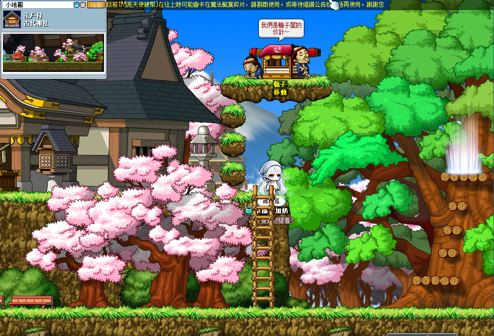
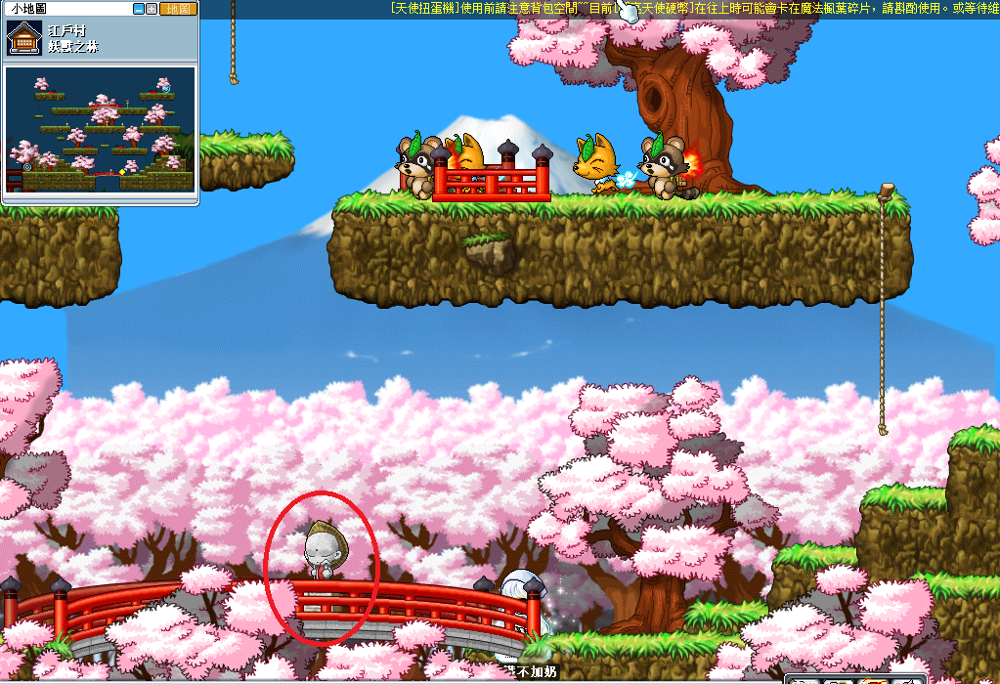
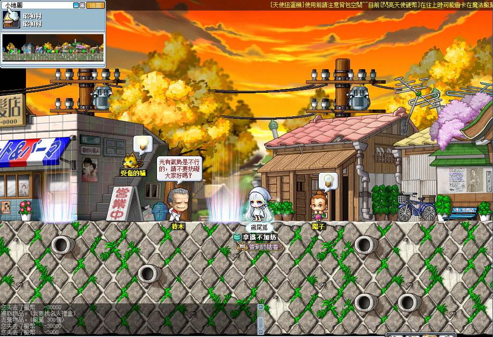
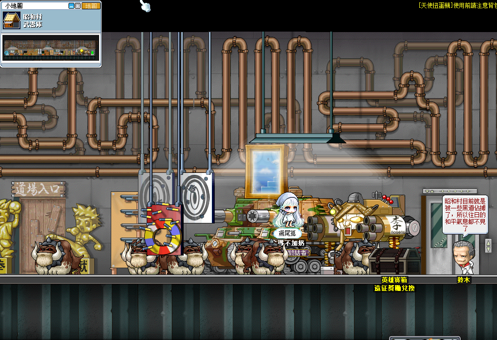
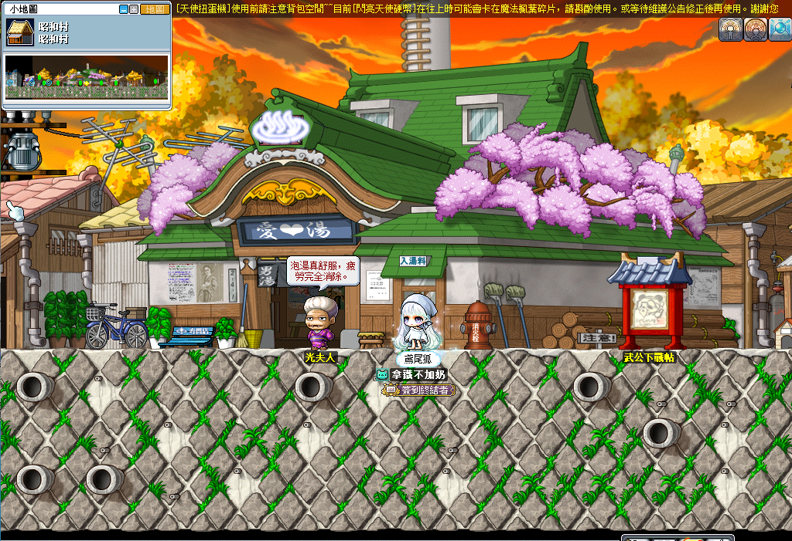
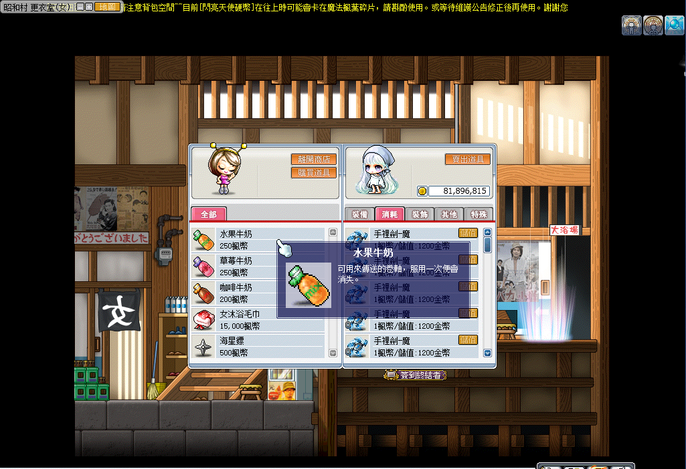

# 昭和村 - 武器庫走法

1. 使用世界旅遊嚮導到古代神社，右邊傳點一直往右走。

    

2. 這個隱藏傳點可以快速到上面，在地圖下方中間。

    

3. 到昭和村內部街道繼續走到昭和村，點選理髮店隔壁的鈴木進入基地，往裡面走就能到武器庫。

    

    

    

4. 在昭和村的澡堂裡可以購買水果牛奶，點選光夫人進入澡堂。

    水果牛奶可以從古代神社地圖到昭和村，草莓牛奶可以從昭和村到古代神社，咖啡牛奶就是回家卷軸。

    

    
